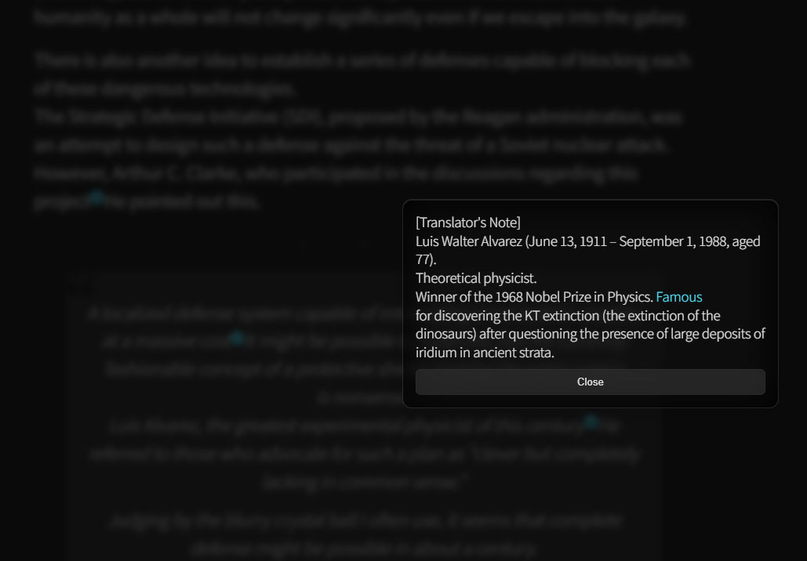

# 📝 Footnotes Tooltip for WordPress

A lightweight, zero-dependency vanilla JS plugin that transforms standard WordPress footnotes into elegant, interactive tooltips.

## 🎯 Goals & Intent

- **Seamless Reading Experience**: The primary goal is to allow readers to access footnote content instantly without jumping to the bottom of the page, ensuring a natural and uninterrupted reading flow.
- **Minimalist & Pure**: This plugin was developed to avoid heavy dependencies (like jQuery) or complex code bundles, providing a high-performance solution with clean, native JavaScript and CSS.

## 🔗 Demo & Docs

- **Live Demo**: [https://frosteye.net/12427/](https://frosteye.net/12427/)
  - *Note: The demo page content is provided in **Korean**.*
- **Documentation (Korean)**: 🚧 **Coming Soon**
  - *Detailed guides and setup instructions in Korean will be available shortly.*

## 📷 Preview

  
   
  <em>The elegant glassmorphism tooltip in action.</em>

---

## ⚠️ Requirements & Environment

- **Tested Environment**:
  - **WordPress**: 6.4.4 (Compatible with 6.1+)
  - **PHP**: 8.3.30 (Compatible with 7.4+)
  - **Theme**: Optimized and tested with **Twenty Twenty-Five**.
- **Browsers**: Modern browsers (Chrome, Safari, Edge, Firefox). **IE is not supported.**
- **Compatibility with Other Plugins**: Not tested. This plugin may conflict with other footnote-related plugins. It is highly recommended to **use only one plugin of this type at a time**.

## ✨ Key Features

- **Security & Privacy**: Designed with security in mind. It uses standard DOM APIs and does not collect any user data or require external API calls.
- **Blog Optimized**: Specially designed for content-heavy blogs to provide a seamless reading experience without annoying page jumps.
- **Dark Mode Optimized**: Features a modern Glassmorphism UI (blur & transparency) designed specifically for dark themes.
- **Mobile Optimized**: Responsive modal-style layout for mobile devices with multi-touch pinch-to-zoom support.
- **Accessible**: Full keyboard navigation support (Focus trapping & Escape to close).
- **Performance**: Smart asset loading (only on pages with footnotes) and AJAX/PJAX compatible.
- **Smart Positioning**: Automatic flip (top/bottom) based on available viewport space.

## 🚀 Installation

1. Download the latest repository as a `.zip` file or grab a version from the **[Releases](https://github.com/FROSTEYe-actual/footnotes_tooltip/releases/)** section.
2. Go to your **WordPress Admin > Plugins > Add New Plugin > Upload Plugin**.
3. Select the downloaded `.zip` file and click **Install Now**.
4. **Activate** the plugin.

## ⚙️ Uninstallation

1. Go to your **WordPress Admin > Plugins > Installed Plugins**.
2. **Deactivate** the plugin and then **Delete** it.
3. This plugin is completely clean; it does not store any data (such as database tables or metadata) on your server or database. **Simply deleting the plugin is all you need for a full uninstallation.**

## 📖 Usage

- Works automatically with the standard **WordPress Footnotes block** or any `` tags containing internal links. **No extra configuration required.**
- Most design elements are **separated** into the `style.css` file, allowing you to easily **fine-tune** the look to match your specific WordPress site.

## 🤝 Contributing & Support

- **Project Status**: This project is considered **feature-complete** and is provided "as is." Active maintenance, regular updates, or bug fixes are not planned at this time.
- **Forking**: You are more than welcome to **Fork** this repository if you wish to modify, improve, or customize the code for your own needs. 
- **Pull Requests**: Due to limited time and commitments to other projects, **Pull Requests will not be reviewed or merged.** Please maintain your own versions through Forking.
- **Issues**: If you find a bug, you may open an [Issue](https://github.com/FROSTEYe-actual/footnotes_tooltip/issues) for others to see, but please note that a response or fix from the author is not guaranteed.

## 💖 Donation

This plugin and all its resources are provided entirely free of charge. However, maintaining a high-quality, ad-free experience involves consistent operational costs, including server hardware, electricity, domain fees, and infrastructure maintenance.

Currently, small revenue from ads and affiliate links on my blog help, but the project fundamentally operates at a loss. Your support, no matter the size, provides the vital resources needed to keep this project running and to continue developing helpful WordPress plugins. Thank you for being a part of this journey.

- **[Official Donation Page](https://frosteye.net/donation/)**

*Your kindness is the greatest motivation for independent open-source development.*

## 📜 Changelog

- **v1.0.2**: Added a screenshot.
- **v1.0.1**: Minor bug fix.
  - Resolved a bug that stripped cross-reference links when displaying footnote content in the tooltip.
  - Enhanced code readability by adding detailed comments to `javascript.js`.
- **v1.0.0**: Initial Release. Features glassmorphism UI, mobile support, and full accessibility.

## 🔮 Future Updates & Roadmap

This is a **personal project**, and while it is currently feature-complete for its primary purpose, I have the following milestones planned for the long-term roadmap:

- **Official WordPress.org Hosting**: My current focus is preparing the plugin for submission to the [official WordPress Plugin Directory](https://wordpress.org/plugins/) to provide seamless updates and wider accessibility.
- **Basic Settings Page**: In the distant future, I may consider adding a simple settings page in the WordPress admin dashboard for UI customization. **Please note that this is currently a low priority.**

> **Note**: These updates are part of my personal long-term vision. There is no fixed release date, as the transition to the official directory is the main priority at this stage.

## 📄 License

Distributed under the **MIT License**. See the [LICENSE](LICENSE) file for more information.

---
Developed by [FROSTEYe](https://frosteye.net/)
